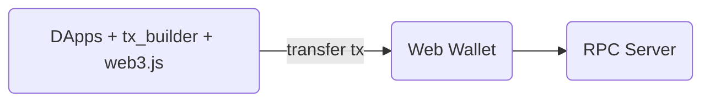

# tx-builder-wasm
Transaction Builder made in Wasm to use on edge/browser/cli

## Problem
Too much js dependency and builder/helper code needed for create transfer transaction.

### Before
`DApps` will need `web3.js` and `tx_builder` code to make a transfer transaction.


## Proposed Solution
Use `web3-lite.wasm` = `web3` + `tx-builder` on the edge/browser.

### After 
1. Keep compatible (Fully trust browser): `DApps` can still use `web3-lite.wasm` as usual; plus able to build transfer transaction.
  ```mermaid
  graph LR
      A(DApps+web3-lite.wasm) -- transfer tx --> Y(Web Wallet) --> Z(RPC Server)
  ```

2. Lean dependency (Fully trust edge): `DApps` can use `web3-lite.wasm` on the edge and build transfer with prompt as [transfer spec](https://docs.solanapay.com/spec#specification-transfer-request).
  ```mermaid
  graph LR
      A(DApps) -- transfer prompt --> B(edge+web3-lite.wasm) -- transfer tx --> Y(Web Wallet) --> Z(RPC Server)
  ```

3. Two factors (No trust): `DApps` use built tx from edge as a cross check (required same `tx_bytes_hash`).
  ```mermaid
  graph LR
      A(DApps+web3-lite.wasm) -- transfer tx --> C{Cross check}
      A(DApps) -- transfer prompt --> B(edge+web3-lite.wasm) -- transfer tx --> C{Same tcx?} -- yes --> Y(Web Wallet) --> Z(RPC Server)
  ```
