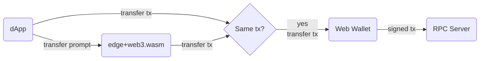

# tx-builder-wasm

Transaction Builder made in Wasm to use on edge/browser/cli

## Problem 🤔

[Solana Pay transfer spec](https://docs.solanapay.com/spec#specification-transfer-request) can be use only on mobile, and to accomplish the same thing on web wallet (`Phantom`) we will need a lot of `web3.js` dependency and [builder/helper code](https://github.com/solana-labs/solana-pay/blob/master/core/src/createTransfer.ts) for create simple transfer transaction.

### Before

`dApp` will need `web3.js` and `tx_builder` code to make a transfer transaction.

## Proposed Solution 🙌

Use `web3.wasm` = `web3` + `tx-builder` on the edge and/or browser.

### After

1. Keep compatible (Fully trust browser): `dApp` can still use `web3.wasm` as usual; plus able to build transfer transaction.

2. Lean dependency (Fully trust edge): `dApp` can use `web3.wasm` on the edge and build transfer with prompt as [transfer spec](https://docs.solanapay.com/spec#specification-transfer-request).

3. Two factors (No trust): `dApp` use built tx from edge as a cross check (required same `tx_bytes_hash`).

## Use cases

- `dApp` can request some specified token amount from user without any `web3.js` lib install. (At the time of writing this can be accomplish only on mobile via `solana pay`'s deeplink)
- `dApp` can ensure that built transaction is not compromise by doing cross check against on-edge.

## Supported By

<a href="https://www.fastly.com/"><img width="auto" height="32px" src="data:image/svg+xml;base64,PD94bWwgdmVyc2lvbj0iMS4wIiBlbmNvZGluZz0idXRmLTgiPz4KPCEtLSBHZW5lcmF0b3I6IEFkb2JlIElsbHVzdHJhdG9yIDIzLjAuMSwgU1ZHIEV4cG9ydCBQbHVnLUluIC4gU1ZHIFZlcnNpb246IDYuMDAgQnVpbGQgMCkgIC0tPgo8c3ZnIHZlcnNpb249IjEuMSIgaWQ9IkxheWVyXzEiIHhtbG5zPSJodHRwOi8vd3d3LnczLm9yZy8yMDAwL3N2ZyIgeG1sbnM6eGxpbms9Imh0dHA6Ly93d3cudzMub3JnLzE5OTkveGxpbmsiIHg9IjBweCIgeT0iMHB4IgoJIHZpZXdCb3g9IjAgMCAxNzA5IDczNSIgZW5hYmxlLWJhY2tncm91bmQ9Im5ldyAwIDAgMTcwOSA3MzUiIHhtbDpzcGFjZT0icHJlc2VydmUiPgo8cG9seWdvbiBmaWxsPSIjRkYyODJEIiBwb2ludHM9IjExMzUuMTA3LDEyOS45MyAxMTM1LjEwNyw1MzUuNDIzIDEyNTYuOTA5LDUzNS40MjMgMTI1Ni45MDksNDczLjQ2NyAxMjE2LjY1OSw0NzMuNDY3IAoJMTIxNi42NTksNjguMTY0IDExMzUuMDk1LDY4LjE3NSAiLz4KPHBhdGggZmlsbD0iI0ZGMjgyRCIgZD0iTTc3LjQzNyw0NzMuNDY3aDQxLjQwNVYyNzcuODM2SDc3LjQzN3YtNTMuODAxbDQxLjQwNS02LjgwOXYtNTQuNDYyYzAtNjUuOTY5LDE0LjM1OS05NC41OTgsOTguNDg3LTk0LjU5OAoJYzE4LjE3LDAsMzkuNzA3LDIuNjgzLDU4LjU2Myw2LjA4bC0xMS4xNzYsNjYuMzE0Yy0xMi43Ny0yLjAyMy0xOS4xMDQtMi4zODItMjcuMTc2LTIuMzgyYy0yOS42MzksMC0zNy4xMzMsMi45NTctMzcuMTMzLDMxLjkxNgoJdjQ3LjEzMWg2MS41NDF2NjAuNjExaC02MS41NDF2MTk1LjYzMmg0MC45NzN2NjEuOTQ2bC0xNjMuOTQxLDAuMDE3VjQ3My40Njd6Ii8+CjxwYXRoIGZpbGw9IiNGRjI4MkQiIGQ9Ik0xMDkzLjYxNyw0NTMuODg5Yy0xMi43NTksMi42OTItMjMuOTE1LDIuMzY4LTMxLjk4OCwyLjU2N2MtMzMuNTU3LDAuODI1LTMwLjY1OC0xMC4yMDQtMzAuNjU4LTQxLjg0NAoJVjI3Ny44MzZoNjMuODczdi02MC42MTFoLTYzLjg3M1Y2OC4xNjRoLTgxLjU2M3YzNjMuMzU4YzAsNzEuMzQxLDE3LjYwNiwxMDMuOSw5NC4zMzksMTAzLjljMTguMTczLDAsNDMuMTQ0LTQuNjc2LDYxLjk5Ny04LjcxNAoJTDEwOTMuNjE3LDQ1My44ODl6Ii8+CjxwYXRoIGZpbGw9IiNGRjI4MkQiIGQ9Ik0xNjAwLjI5Nyw0NzMuOGMxNy4xNDEsMCwzMS4wMjMsMTMuNjI1LDMxLjAyMywzMC43NjhjMCwxNy4xMzgtMTMuODgzLDMwLjc2LTMxLjAyMywzMC43NgoJYy0xNy4xNDEsMC0zMC45NDEtMTMuNjIyLTMwLjk0MS0zMC43NkMxNTY5LjM1Nyw0ODcuNDI1LDE1ODMuMTU3LDQ3My44LDE2MDAuMjk3LDQ3My44IE0xNjAwLjI5Nyw1MzAuNDkzCgljMTQuMjM5LDAsMjUuODM3LTExLjY4OCwyNS44MzctMjUuOTI1YzAtMTQuMjQ1LTExLjU5OC0yNS41NzktMjUuODM3LTI1LjU3OWMtMTQuMjM2LDAtMjUuNzU4LDExLjMzNS0yNS43NTgsMjUuNTc5CglDMTU3NC41NCw1MTguODA0LDE1ODYuMDYxLDUzMC40OTMsMTYwMC4yOTcsNTMwLjQ5MyBNMTYwNi4wMSw1MTkuNjgybC02LjI0Mi05LjE0MWgtNC4zMDZ2OS4xNDFoLTYuOTQxdi0zMC4yMzloMTIuNjUxCgljNy40NzMsMCwxMi4xMzMsMy43ODIsMTIuMTMzLDEwLjQ2OGMwLDQuOTE0LTIuNDYzLDguMjU4LTYuMzI3LDkuMzk4bDcuNTU4LDEwLjM3MkgxNjA2LjAxeiBNMTU5NS40NjMsNTA0LjQ3NUgxNjAxCgljMy4xNjgsMCw1LjI3Ni0xLjIyOSw1LjI3Ni00LjU2M2MwLTMuMTY1LTIuMTA5LTQuNDAyLTUuMTA0LTQuNDAyaC01LjcxVjUwNC40NzV6Ii8+CjxwYXRoIGZpbGw9IiNGRjI4MkQiIGQ9Ik04NDcuNTkzLDI3Ny43MjV2LTEwLjg1MWMtMjQuNjc1LTQuNTAxLTQ5LjE3OC00LjU2Ni02Mi40Ny00LjU2NmMtMzcuOTU3LDAtNDIuNTg1LDIwLjEyOS00Mi41ODUsMzEuMDQKCWMwLDE1LjQzNiw1LjI2NywyMy43ODIsNDYuMzg4LDMyLjc3M2M2MC4xMDcsMTMuNDk0LDEyMC40NzMsMjcuNTczLDEyMC40NzMsMTAyLjEwNGMwLDcwLjY4Mi0zNi4zNzcsMTA3LjE5OC0xMTIuOTQ3LDEwNy4xOTgKCWMtNTEuMjM4LDAtMTAwLjk1NC0xMC45OTktMTM4Ljg4OC0yMC42MjV2LTYwLjkwOWg2MS43NjRsLTAuMDM2LDEwLjgyMWMyNi41NzksNS4xMzQsNTQuNDQ4LDQuNjIsNjguOTk3LDQuNjIKCWM0MC40ODcsMCw0Ny4wMzctMjEuNzY3LDQ3LjAzNy0zMy4zNGMwLTE2LjA2MS0xMS42MTEtMjMuNzc0LTQ5LjU2Mi0zMS40N2MtNzEuNS0xMi4yMTctMTI4LjI0NC0zNi42MjgtMTI4LjI0NC0xMDkuMjU3CgljMC02OC43NDYsNDUuOTc5LTk1LjcxNCwxMjIuNTUtOTUuNzE0YzUxLjg3NSwwLDkxLjMxOCw4LjA0NSwxMjkuMjcyLDE3LjY3NnY2MC41SDg0Ny41OTN6Ii8+CjxwYXRoIGZpbGw9IiNGRjI4MkQiIGQ9Ik00NzIuMzMzLDMzMS4yNjNsLTYuMjA3LTYuMjA5bC0zMS41MjIsMjcuNDdjLTEuNTkxLTAuNTctMy4yOTMtMC44OTctNS4wNzEtMC44OTcKCWMtOC41MDYsMC0xNS4zOTIsNy4wODktMTUuMzkyLDE1LjgyNGMwLDguNzQ1LDYuODg2LDE1LjgzMiwxNS4zOTIsMTUuODMyYzguNTAyLDAsMTUuNDA0LTcuMDg3LDE1LjQwNC0xNS44MzIKCWMwLTEuNjU5LTAuMjUyLTMuMjU3LTAuNzEzLTQuNzZMNDcyLjMzMywzMzEuMjYzeiIvPgo8cGF0aCBmaWxsPSIjRkYyODJEIiBkPSJNNTk3LjI2MSw0NTMuODg5bC0wLjA1My0yNTMuODFoLTgxLjU2MnYyMy44MDJjLTE2Ljc5OS0xMC4wNzgtMzUuNTExLTE3LjI4NS01NS40NTUtMjAuOTc5aDAuNDYxdi0yOC4xNjYKCWg5Ljk1MXYtMjAuNzE0aC04Mi4xMjV2MjAuNzE0aDkuOTV2MjguMTY2aDAuNTY2Yy03OC4wMDksMTQuMzYxLTEzNy4xMjYsODIuNjcxLTEzNy4xMjYsMTY0LjgzMwoJYzAsOTIuNTk1LDc1LjA2MiwxNjcuNjU3LDE2Ny42NTcsMTY3LjY1N2MzMS42MDIsMCw2MS4xNTUtOC43NTUsODYuMzg1LTIzLjk1NWwxNC42OTQsMjMuOTg2aDg2LjE1MnYtODEuNTM1SDU5Ny4yNjF6CgkgTTQzNC40MSw0NTMuNzA0di05LjU4OGgtOS43NzJ2OS41NjFjLTQzLjc3NS0yLjU1MS03OC43ODktMzcuNzIxLTgxLjA3My04MS41NjdoOS43MTN2LTkuNzcyaC05LjY2MwoJYzIuNTk2LTQzLjU0MiwzNy40NjYtNzguMzc4LDgxLjAyMy04MC45MTd2OS42MWg5Ljc3MnYtOS42MzhjNDIuOTM1LDIuMjk1LDc3LjUyLDM1Ljk3Myw4MS4yNTcsNzguNTF2Mi44MDJoLTkuNzkxdjkuNzcyaDkuNzkzCglsMC4wMDEsMi42NzZDNTExLjk1Myw0MTcuNzEsNDc3LjM1OSw0NTEuNDA5LDQzNC40MSw0NTMuNzA0eiIvPgo8cGF0aCBmaWxsPSIjRkYyODJEIiBkPSJNMTQ2My4zNCwyMTcuMjI1aDE2OC4yMjN2NjAuNTUyaC00MC4yMDlsLTEwMy4xNywyNTMuODJjLTI5LjU2OSw3MS4zLTc4LjEzNiwxMzguNDA4LTE1Mi4xMDIsMTM4LjQwOAoJYy0xOC4xODYsMC00Mi4zOTYtMi4wMTUtNTkuMTg1LTYuMDQ5bDcuMzc3LTc0LjAyOGMxMC43NzMsMi4wMTUsMjQuODg0LDMuMzQxLDMyLjI4OCwzLjM0MWMzNC4zMDEsMCw3Mi45OTMtMjEuMjUzLDg1LjA5NC01OC4yNTcKCWwtMTA0LjUzNi0yNTcuMjMzaC00MC4yMTF2LTYwLjU1MmgxNjguMzF2NjAuNTUyaC00MC4yMDVsNTkuMjIzLDE0NS43MDJsMCwwbDU5LjIyMy0xNDUuNzAyaC00MC4xMjFWMjE3LjIyNXoiLz4KPC9zdmc+Cg=="/></a>
