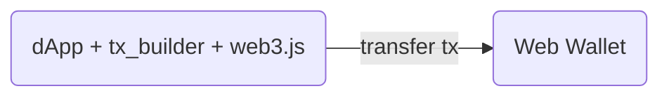
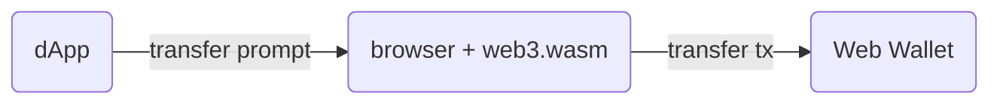
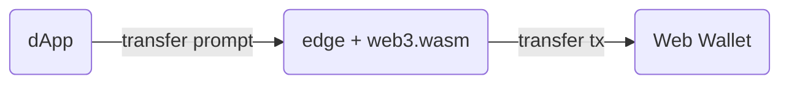
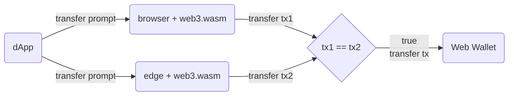

# tx-builder-wasm

Transaction Builder made in Wasm to use on edge/browser/cli

## Problem 🤔

[Solana Pay transfer spec](https://docs.solanapay.com/spec#specification-transfer-request) can be use only on mobile, and to accomplish the same thing on web wallet (`Phantom`) we will need a lot of `web3.js` dependency and [builder/helper code](https://github.com/solana-labs/solana-pay/blob/master/core/src/createTransfer.ts) for create simple transfer transaction.

### Before

`dApp` will need `web3.js` and `tx_builder` code to make a transfer transaction.

## Proposed Solution 🙌

Use `web3.wasm` = `web3` + `tx-builder` on the edge and/or browser.

### After

1. Keep compatible (Fully trust browser): `dApp` can still use `web3.wasm` as usual; plus able to build transfer transaction.

2. Lean dependency (Fully trust edge): `dApp` can use `web3.wasm` on the edge and build transfer with prompt as [transfer spec](https://docs.solanapay.com/spec#specification-transfer-request).

3. Cross check: `dApp` use built tx from edge as a cross check (required same `tx_bytes_hash`).

## Use cases

- `dApp` can make a payment `Button` for some specified token amount from user _without_ any `web3.js` lib required on both mobile app with `solana pay`'s deeplink (already exists solution) and on web with browser/edge (our solution).
- `dApp` can ensure that built transaction is not compromise by doing cross check between browser and on-edge.

## Supported By

